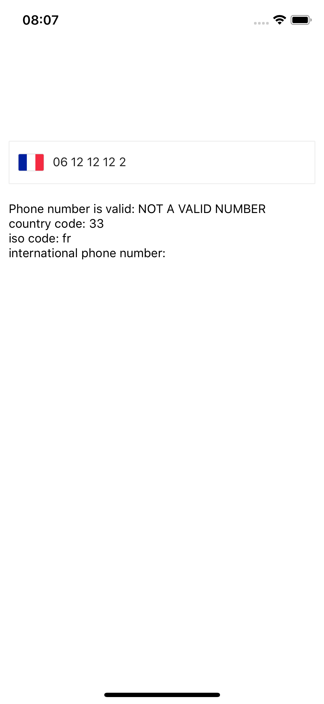
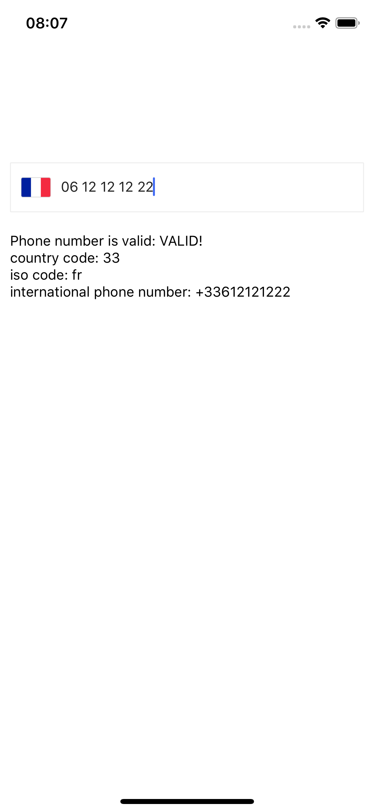

# react-native-smooth-phone-input

> react-native user friendly phone input (users may not like country codes when typing their phone number 😉)

IT:

- follows national patterns (who write his own phone number in international pattern 🤨)
- validates number
- gives international matching number (*backend may prefer international pattern*)

BUT IT:

- does not make ☕️ (not planned to do so, sorry 😋)

  
  
  

